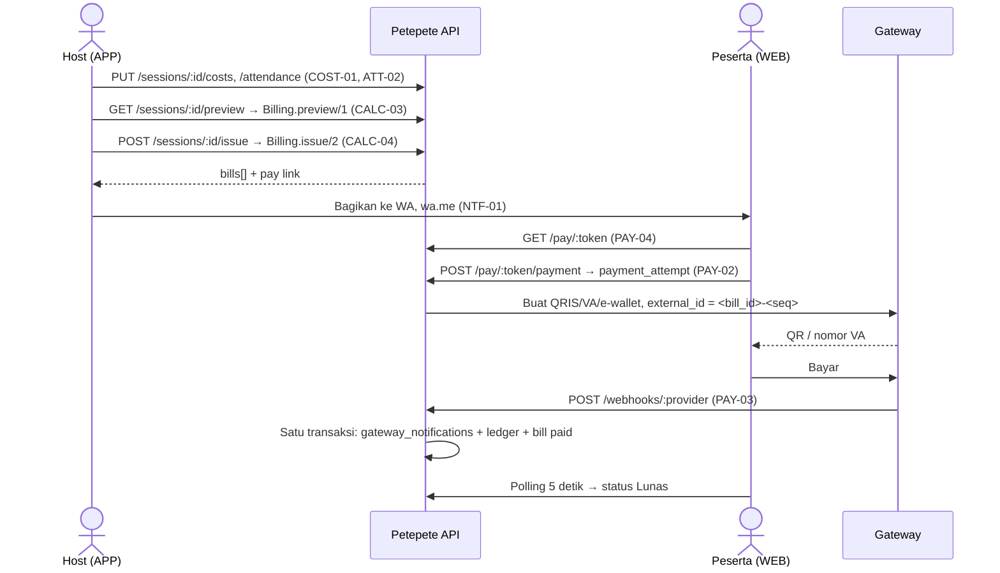
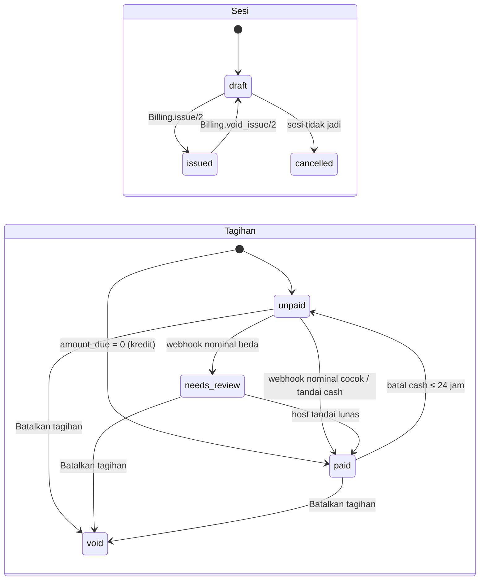

# Petepete MVP — Spec Teknis & Tiket Pengembangan

Oct 1, 2026 · @Zayyana Choir · Revisi 2: Oct 3, 2026 · Revisi 3: Oct 6, 2026

## Ringkasan & konvensi

MVP Petepete dipecah menjadi 11 epic dan 39 tiket P0, total 116 story point (≈ 58 hari kerja solo), untuk 12 minggu pengembangan setelah 2 minggu validasi desain (total 14 minggu). Enam tiket (17 SP) digeser ke P1 agar muat: REL-04, NTF-02, NTF-03, LDG-03, ATT-01, GRP-04. Semua tiket diturunkan dari fitur P0 di PRD Petepete; fitur P1/P2 hanya dicatat sebagai backlog.

**Perubahan dari revisi 1**

- Biaya gateway masuk aturan hitung: peserta menanggung biaya di atas `amount_due` (satu-satunya opsi di MVP).
- Alur webhook dijalankan dalam satu transaksi DB; dedup per (transaksi, status); lebih bayar menjadi kredit.
- Tabel `payment_attempts` baru: tiap permintaan bayar punya `external_id` unik, karena gateway menolak ID order ganda.
- Tiket baru: CALC-05 (Batalkan tagihan), LDG-05 (pelunasan antar anggota & belanja kas), PAY-07 (tarik dana).
- Bobot disimpan sebagai integer per mil; pembagian dihitung sebagai pecahan eksak.
- Aturan kredit dikunci (lihat Aturan hitung langkah 6).
- Skema ditambah `users`, `refresh_tokens`, `otp_challenges`, `payout_accounts`, `audit_log`; ledger memakai `account_type` + `member_id`.
- Peran "admin" dihapus; semua aksi admin adalah aksi host.

**Perubahan dari revisi 2** (ADR-0001)

- `ledger_txns.kind` kini tepat delapan nilai, satu per kejadian uang di `CONTEXT.md`; `reversal` dipecah menjadi `session_bills_cancelled`, `cash_payment_cancelled`, `correction`.
- `Ledger.reverse/2`, `record_settlement/2`, `record_kas_spend/2` diganti satu pintu tulis `Ledger.record/2`; aturan balik dan batas 24 jam dipegang Ledger (lihat Antarmuka Ledger).
- Ledger berjalan di dalam transaksi pemanggil dan mengunci per grup; idempotensi wajib untuk semua kejadian; Actor hanya `host` atau `gateway`.
- Kas boleh negatif akibat pembatalan tagihan; belanja kas ditolak bila jumlahnya melebihi saldo kas.
- Billing memegang status sesi, pos biaya, kehadiran, dan tagihan; Sessions hanya penjadwalan (events, rrule, pembuatan sesi draft).
- `settled` diturunkan dari tagihan, tidak disimpan; `void` pada tagihan hanya lewat `Billing.void_issue/2`.
- Urutan kunci Billing: sesi, tagihan (urut id), lalu kunci grup Ledger; webhook memanggil Billing untuk keputusan tagihan.
- Tabel `payment_events` berganti nama menjadi `gateway_notifications`.

**Keputusan teknis** (backend menggantikan Supabase di PRD)

- Aplikasi host: Flutter, rilis Android dulu, iOS setelah validasi.
- Halaman bayar peserta: Next.js di Vercel, tanpa login.
- Backend: Elixir/Phoenix (JSON API) + Ecto + PostgreSQL, Oban untuk job terjadwal, ledger diposting dalam satu `Ecto.Multi`; hosting Fly.io region Singapura.
- Pembayaran: gateway dengan sub-account (Xendit atau Midtrans, belum dipilih). Petepete tidak menampung dana.
- Tamu cukup nama; nomor WA opsional.

**Konvensi tiket**

| Field | Aturan |
| --- | --- |
| ID | `PP-<epic>-<nomor>`, misal PP-PAY-03. Kolom Dep dan teks memakai bentuk singkat tanpa `PP-` |
| Prioritas | P0 = wajib MVP, P1 = setelah gerbang 30 grup aktif, P2 = nanti |
| Estimasi | Story point Fibonacci (1, 2, 3, 5, 8); 1 SP ≈ setengah hari kerja solo |
| Lapisan | APP (Flutter), WEB (Next.js), API (Phoenix context + controller), JOB (Oban), DB (Postgres/Ecto), OPS |
| Dependensi | ID tiket yang harus selesai lebih dulu |

**Definition of Done (berlaku semua tiket)**

- [ ] Acceptance criteria terpenuhi dan diuji manual di HP Android kelas menengah bawah.
- [ ] Fungsi uang (hitung, ledger, webhook) punya unit test; semua angka dalam rupiah integer, tanpa float.
- [ ] Endpoint yang memposting ledger diuji dengan request ganda: hasil tetap satu txn.
- [ ] Otorisasi per grup diuji: anggota grup lain tidak bisa membaca data.
- [ ] Teks UI berbahasa Indonesia santai, status selalu disertai teks (bukan warna saja).
- [ ] Error dikirim ke Sentry; tidak ada nomor HP di log.

## Diagram flow

Host hanya melakukan 3 aksi per sesi (isi biaya, centang hadir, kirim tagihan). Status lunas tidak pernah diubah langsung oleh host atau peserta, hanya oleh webhook gateway, tandai cash, atau kredit saldo.

Tandai cash (PAY-05) memotong alur setelah tagihan terbit: host langsung memanggil `Billing.mark_paid_cash/2`, tanpa gateway.

Label UI: draft = Draft, issued = Ditagih, cancelled = Batal; unpaid = Belum bayar, paid = Lunas, needs_review = Perlu dicek, void = Dibatalkan. Selesai bukan status tersimpan: sesi issued dengan ≥ 1 tagihan non-void yang semuanya paid tampil sebagai Selesai, dan kembali Ditagih bila satu tagihan batal bayar (cash).

Transisi di luar diagram ditolak oleh Billing, satu-satunya pemilik status sesi dan tagihan; Sessions hanya penjadwalan. Webhook dengan nominal berbeda tidak memposting, hanya mengubah tagihan ke `needs_review`; host menyelesaikannya lewat Tandai lunas (PAY-05) atau Catat pelunasan (LDG-05). Pembatalan cash dalam 24 jam mengembalikan tagihan ke `unpaid` lewat kejadian `cash_payment_cancelled`.

Batasan P0: Tandai lunas atas tagihan `needs_review` memposting `cash_received` sebesar `amount_due` atas nama host yang menandai. Uang gateway yang sebenarnya ada pada pemilik rekening pencairan dan hanya tercatat di `payment_attempts.paid_amount`; ini keliru bila host berbeda dari pemilik rekening atau pembayaran kurang. Tinjau ulang saat gateway dipilih.

## Model data & aturan hitung

Semua uang disimpan sebagai rupiah integer (`bigint`) dan setiap perubahan saldo lewat satu transaksi ledger double-entry yang jumlahnya nol. Tabel di bawah adalah skema minimum untuk P0.

| Tabel | Kolom utama | Catatan |
| --- | --- | --- |
| `users` | id, phone (unique, format 62…), display\_name, deleted\_at | Dianonimkan saat hapus akun |
| `otp_challenges` | id, phone\_hash, code\_hash, ip, attempts, expires\_at | Kode tidak disimpan polos |
| `refresh_tokens` | id, user\_id, token\_hash, expires\_at, revoked\_at | Rotasi tiap refresh |
| `groups` | id, name, template, rounding\_unit (500/1000, default 1000), invite\_token | Satu grup = satu buku kas |
| `payout_accounts` | id, group\_id, owner\_member\_id, provider, provider\_account\_id, status (pending\_kyc/active), bank\_name, account\_last4 | Pemilik = penerima uang gateway di ledger |
| `group_members` | id, group\_id, user\_id (nullable), claim\_user\_id (nullable), display\_name, phone (nullable), role (host/member/guest), default\_weight | Unique (group\_id, user\_id) bila user\_id terisi |
| `events` | id, group\_id, name, type (recurring/one\_off), rrule, starts\_at (one\_off), cost\_template (jsonb), split\_rule, active | rrule mis. `FREQ=WEEKLY;BYDAY=TH` |
| `sessions` | id, event\_id, group\_id, starts\_at, status (draft/issued/cancelled), issue\_txn\_id | Unique (event\_id, starts\_at); Selesai diturunkan dari `bills`, tidak disimpan |
| `cost_items` | id, session\_id, category, label, amount, paid\_by\_member\_id, scope (all/subset) | Penalang = paid\_by |
| `cost_item_members` | cost\_item\_id, member\_id | Hanya untuk scope = subset |
| `session_participants` | session\_id, member\_id, attended, weight | Yang dihitung hanya attended = true |
| `bills` | id, session\_id, member\_id, share, credit\_applied, amount\_due, status, paid\_via (gateway/cash/credit), paid\_txn\_id, paid\_at, pay\_token, token\_expires\_at | Unique (session\_id, member\_id) WHERE status ≠ void |
| `payment_attempts` | id, bill\_id, seq, external\_id (unique), provider, method, provider\_ref, amount\_due, fee, gross\_amount, paid\_amount, status (pending/paid/expired/failed/cancelled), action (jsonb), expires\_at | Satu per permintaan bayar |
| `ledger_txns` | id, group\_id, kind, ref\_type, ref\_id, actor\_type (host/gateway), actor\_user\_id (nullable), reverses\_txn\_id (unique), reason, idempotency\_key (unique) | Append-only |
| `ledger_entries` | id, txn\_id, group\_id, account\_type (member/kas), member\_id (nullable), amount | amount bertanda; jumlah per txn = 0 |
| `gateway_notifications` | id, provider, provider\_txn\_id, provider\_status, payload, outcome, processed\_at | Satu per notifikasi gateway; unique (provider, provider\_txn\_id, provider\_status) |
| `audit_log` | id, group\_id, actor\_user\_id, action, subject\_type, subject\_id, metadata | Semua aksi host yang mengubah uang |

**Aturan skema**

- Bobot (`default_weight`, `weight`) adalah integer per mil: 1000 = 1×, 1200 = 1,2×, 500 = 0,5×. Check constraint > 0.
- `pay_token` dan `invite_token` acak ≥ 128 bit, url-safe.
- Jumlah entri per txn = 0 dijaga constraint trigger `DEFERRABLE INITIALLY DEFERRED` (entri diinsert per baris). `ledger_entries` dan `ledger_txns` menolak UPDATE/DELETE lewat trigger.
- `account_type = member` wajib `member_id`; `account_type = kas` wajib `member_id` null.
- `reverses_txn_id` unique: satu txn hanya bisa dibalik sekali.
- `kind` dibatasi check constraint ke delapan nilai: `session_billed`, `gateway_payment_received`, `cash_received`, `settlement`, `kas_spend`, `session_bills_cancelled`, `cash_payment_cancelled`, `correction`.
- `reverses_txn_id` hanya boleh terisi untuk tiga kind pembatal; `reason` wajib untuk ketiganya.
- `actor_type = host` wajib `actor_user_id`; `actor_type = gateway` wajib `actor_user_id` null.

**Akun ledger per grup.** Satu akun per anggota/tamu (`member`) dan satu `kas` grup. Saldo anggota = jumlah entri; negatif berarti masih utang ke grup, positif berarti punya kredit. Saldo negatif pemilik rekening pencairan berarti ia sedang memegang uang grup.

| Kejadian uang (`kind`) | Entri (debit = −, kredit = +) |
| --- | --- |
| Tagihan sesi diterbitkan (`session_billed`) | −`share` ke tiap peserta; +nominal pos ke penalang pos itu; +selisih pembulatan ke `kas` |
| Peserta bayar via gateway (`gateway_payment_received`) | +`amount_due` attempt ke peserta; −`amount_due` ke pemilik rekening pencairan. Biaya gateway dibayar peserta di atas `amount_due`, tidak masuk ledger, dicatat di `payment_attempts.fee`. Lebih bayar atau bayar tagihan void: entri sama, tagihan tidak berubah, hasilnya kredit peserta |
| Tandai lunas cash (`cash_received`) | +`amount_due` ke peserta; −`amount_due` ke host yang menandai (penerima cash) |
| Pelunasan antar anggota (`settlement`) | +X ke pembayar; −X ke penerima (mis. host mengganti talangan Andi: +X host, −X Andi) |
| Belanja dari kas (`kas_spend`) | −X ke `kas`; +X ke anggota yang membayar belanjaan |
| Tagihan sesi dibatalkan (`session_bills_cancelled`) | Entri kebalikan dari txn `session_billed` |
| Pembayaran cash dibatalkan (`cash_payment_cancelled`) | Entri kebalikan dari txn `cash_received` |
| Koreksi (`correction`) | Entri kebalikan dari txn `settlement` atau `kas_spend` |

Penarikan dana dari sub-account ke rekening bank host (PAY-07) tidak menyentuh ledger: uang itu sudah tercatat dipegang host.

**Antarmuka Ledger (ADR-0001).** Satu pintu tulis: `Ledger.record/2` menerima Actor dan salah satu dari delapan kejadian uang di atas. Pemanggil tidak mengirim entri, tanda, atau akun. Pintu baca: `Ledger.balances/1` dan `Ledger.txns/2`. Billing tidak mengenal tanda; aturan status tagihan (unpaid, void, needs\_review) tetap milik Billing.

- **Transaksi.** Ledger tidak membuka transaksi DB sendiri; ia berjalan di dalam `Ecto.Multi` atau `Repo.transaction` pemanggil, sehingga satu commit mencakup ledger, tagihan, dan `gateway_notifications`.
- **Kunci.** Setiap `record/2` mengambil advisory lock transaksi per grup (`pg_advisory_xact_lock` pada `group_id`), selalu setelah kunci baris yang sudah dipegang pemanggil (mis. `bills ... FOR UPDATE`), agar tidak deadlock dengan alur webhook.
- **Idempotensi.** `idempotency_key` wajib di semua kejadian. Kunci sama dengan kejadian sama mengembalikan txn asli; kunci sama dengan kejadian berbeda adalah galat. `issue` memakai header Idempotency-Key; webhook memakai `<provider>:<provider_txn_id>:<provider_status>`; endpoint tulis uang lain juga menerima header Idempotency-Key.
- **Actor.** `gateway` hanya untuk `gateway_payment_received`; semua kejadian lain `host`. Tidak ada kejadian uang yang dilakukan sistem di P0.
- **Pemilik rekening pencairan.** Ledger menentukannya sendiri saat memposting `gateway_payment_received` dan menuliskannya ke entri; mengganti pemilik kemudian tidak mengubah riwayat. Untuk `cash_received`, penerima adalah host yang menjadi Actor.
- **Aturan per kejadian** (ditolak dengan galat bertipe sebelum trigger DB): semua kejadian: jumlah > 0 dan semua anggota milik grup (tamu dan "Mantan anggota" termasuk). `session_billed`: Σ `share` = Σ talangan + selisih ke kas, selisih ≥ 0. `settlement`: pembayar ≠ penerima. `kas_spend`: jumlah ≤ saldo kas. `cash_received` dan `gateway_payment_received`: tidak ada batas terhadap tagihan; lebih bayar menjadi kredit.
- **Hasil `session_billed`.** Txn plus saldo tiap peserta sesaat sebelum posting; Billing menurunkan `credit_applied` dan `amount_due` dari saldo itu dalam transaksi yang sama. `Billing.preview/1` membaca saldo tanpa kunci, jadi bisa berbeda dari tagihan bila ada pembayaran masuk di antaranya.
- **Yang boleh dibalik.** `session_bills_cancelled` hanya atas `session_billed`; `cash_payment_cancelled` hanya atas `cash_received`; `correction` hanya atas `settlement` atau `kas_spend`. `gateway_payment_received` dan ketiga kejadian pembatal tidak bisa dibalik; satu txn hanya bisa dibalik sekali.
- **Batas 24 jam.** `cash_payment_cancelled` ditolak bila lebih dari 24 jam sejak waktu txn `cash_received`; waktu dikirim sebagai argumen, `bills.paid_at` diisi dari waktu yang sama.
- **Saldo kas.** `kas_spend` ditolak bila jumlah > saldo kas, sehingga tidak ada belanja kas saat saldo kas nol atau negatif. `session_bills_cancelled` tidak diperiksa terhadap saldo kas: pembatalan boleh membuat kas negatif.

**Aturan hitung (`Billing.preview/1`)**

1. Ambil peserta dengan attended = true dan bobotnya.
2. Untuk tiap pos biaya k, penanggungnya adalah semua peserta hadir (scope all) atau `cost_item_members` ∩ peserta hadir (scope subset). W_k = jumlah bobot penanggung pos k.
3. Bagian mentah peserta i = Σ_k amount_k × w_i / W_k, dihitung sebagai pecahan eksak (pembilang dan penyebut integer); tidak ada pembulatan di tengah jalan.
4. `share` = bagian mentah dibulatkan **ke atas** ke kelipatan `rounding_unit`.
5. Selisih ke kas = Σ share − Σ nominal pos (selalu ≥ 0).
6. Kredit tersedia peserta i = max(0, saldo i sebelum penerbitan) + talangan i di sesi ini. `credit_applied` = min(share, kredit tersedia); `amount_due` = share − credit_applied. Tagihan lama yang belum lunas tetap berdiri sendiri dan tidak dipotong kredit.
7. Validasi: tiap pos minimal punya 1 penanggung, bobot > 0, total biaya > 0. Gagal validasi = tagihan tidak bisa dikirim.

**Biaya gateway (`Payments.fee_for/2`).** Biaya per metode (QRIS/VA/e-wallet, termasuk PPN) diambil dari tabel konfigurasi sesuai kontrak gateway. `fee` dipilih sehingga uang bersih yang diterima host = `amount_due`; `gross_amount` = `amount_due` + `fee` adalah nominal yang dibayar peserta dan dicocokkan saat webhook.

**Contoh uji wajib**

| Kasus | Input | Hasil |
| --- | --- | --- |
| Pos subset | 10 hadir; lapangan Rp350.000 + wasit Rp100.000 + minum Rp60.000 untuk 6 orang; pembulatan Rp1.000 | Non-minum Rp45.000, peminum Rp55.000; total Rp510.000; selisih Rp0 |
| Pembulatan | 3 hadir; lapangan Rp100.000; pembulatan Rp1.000 | Tiap orang Rp34.000; total Rp102.000; masuk kas Rp2.000 |
| Bobot | 4 hadir, satu tamu bobot 1200; lapangan Rp210.000 | Anggota Rp50.000, tamu Rp60.000; selisih Rp0 |
| Kredit penalang | Kasus pertama; host menalangi lapangan | Tagihan host Rp0 berstatus paid (`paid_via` = credit); saldo host +Rp305.000 setelah penerbitan |

## Spesifikasi API & webhook

Aplikasi host dan halaman bayar memanggil JSON API Phoenix. Logika ada di modul Elixir: `Accounts`, `Groups`, `Sessions` (penjadwalan event dan pembuatan sesi draft), `Billing` (status sesi, pos biaya, kehadiran, tagihan), `Ledger`, `Payments`. Setiap request dicek keanggotaan grupnya sebelum query, menggantikan peran RLS. Endpoint tulis uang hanya untuk role host.

| Nama | Endpoint / fungsi | Input | Output | Pemanggil |
| --- | --- | --- | --- | --- |
| Login OTP | POST /auth/otp, POST /auth/verify | phone; phone + code | access + refresh token; anggota dengan nomor sama otomatis tertaut | APP |
| Hapus akun | DELETE /me | — | ok | APP |
| Buat grup | POST /groups | name, template | group\_id, invite\_url | APP |
| Gabung grup | POST /invites/:token/join | display\_name, phone? | member\_id | APP / WEB |
| Klaim nama | POST /members/:id/claim, POST /members/:id/claim/approve | —; — (host) | ok | APP |
| Tambah tamu | POST /groups/:id/guests | name, phone? | member\_id | APP |
| Rekening pencairan | POST /groups/:id/payout-account | data KYC & bank sesuai gateway | payout\_account\_id, status | APP |
| Tarik dana | POST /groups/:id/withdrawals | amount | withdrawal\_id, status | APP |
| Buat event | POST /groups/:id/events | type, rrule? / starts\_at?, cost\_template, split\_rule | event\_id, session\_id (one\_off) | APP |
| Generate sesi | Oban Cron harian 00:05 WIB (`SessionScheduler`) | — | sesi baru (status draft) | JOB |
| Pos biaya | PUT /sessions/:id/costs/:cid | category, amount, paid\_by, scope, members? | cost\_item | APP |
| Kehadiran | PUT /sessions/:id/attendance | member\_id, attended, weight? | ok | APP |
| Pratinjau | GET /sessions/:id/preview → `Billing.preview/1` | — | bagian per orang, kredit, selisih ke kas | APP |
| Kirim tagihan | POST /sessions/:id/issue → `Billing.issue/2` | header Idempotency-Key | bills\[\], txn\_id | APP |
| Batalkan tagihan | POST /sessions/:id/void → `Billing.void_issue/2` | reason | txn\_id pembalik | APP |
| Halaman bayar | GET /pay/:token | — | nama grup, tanggal sesi, rincian bagian, status, biaya per metode | WEB |
| Buat pembayaran | POST /pay/:token/payment | metode (qris/va/ewallet) | qr\_string / va\_number / redirect\_url, amount\_due, fee, gross\_amount, expires\_at | WEB |
| Webhook | POST /webhooks/:provider | payload gateway | 200 / 401 / 5xx | Gateway |
| Tandai cash | POST /bills/:id/cash → `Billing.mark_paid_cash/2` | — | txn\_id | APP |
| Batal cash | POST /bills/:id/cash/cancel → `Billing.cancel_cash/2` | reason | txn\_id pembalik | APP |
| Koreksi | POST /txns/:id/correction → `Ledger.record/2` (`correction`) | reason; hanya txn pelunasan antar anggota atau belanja kas | txn\_id baru | APP |
| Pelunasan antar anggota | POST /groups/:id/settlements → `Ledger.record/2` (`settlement`) | from\_member\_id, to\_member\_id, amount, note | txn\_id | APP |
| Belanja kas | POST /groups/:id/kas-spends → `Ledger.record/2` (`kas_spend`) | member\_id, amount, note | txn\_id | APP |
| Saldo | GET /groups/:id/balances → `Ledger.balances/1` | — | saldo kas + saldo per anggota | APP |
| Riwayat | GET /groups/:id/txns | member\_id? | txn kronologis + entri | APP |

**Alur webhook (harus idempoten)**

1. Verifikasi keaslian di plug khusus webhook: token callback (Xendit) atau signature key SHA512 (Midtrans). Gagal → 401, catat ke Sentry.
2. Normalisasi payload → `provider_txn_id`, status (pending/paid/expired/failed), `external_id`, nominal dibayar.
3. Semua langkah berikut dalam **satu transaksi DB**. Insert `gateway_notifications` dengan `ON CONFLICT DO NOTHING` pada (provider, provider\_txn\_id, provider\_status), lalu `SELECT … FOR UPDATE` baris itu. Jika `processed_at` sudah terisi → selesai, 200. Status berbeda untuk transaksi yang sama (pending lalu settlement) adalah notifikasi berbeda.
4. Cari `payment_attempts` lewat `external_id`. Tidak ketemu → outcome `unknown`, Sentry, 200. Kunci tagihannya (`FOR UPDATE`) sesuai urutan kunci Billing.
5. Status non-final, kedaluwarsa, atau gagal → perbarui status attempt saja.
6. Status paid: Payments membandingkan nominal dengan `gross_amount` attempt (hitungan biaya milik penyedia), lalu memanggil `Billing.apply_gateway_payment/2` dengan tagihan, nominal, dan hasil cocok atau tidak. Billing memutuskan hasil tagihan dan memposting ke Ledger:
   - nominal ≠ `gross_amount` attempt → tagihan unpaid menjadi `needs_review`, isi `paid_amount`, tidak memposting;
   - tagihan unpaid → `Ledger.record/2` `gateway_payment_received`, tagihan `paid` (`paid_via` = gateway, `paid_txn_id`, `paid_at`), attempt `paid`;
   - tagihan sudah paid atau void → `Ledger.record/2` `gateway_payment_received` sebagai kredit peserta, outcome `overpaid`, tampil di Status sesi host.
7. Isi `processed_at` dan `outcome`, commit. Error apa pun → rollback dan 5xx, sehingga gateway mengirim ulang dan notifikasi diproses dari awal.

**Aturan `Billing.issue/2`.** Hanya untuk sesi berstatus draft dan lolos validasi; satu `Idempotency-Key` (diteruskan ke Ledger sebagai `idempotency_key`) hanya menghasilkan satu txn `session_billed`. `credit_applied` dan `amount_due` diturunkan dari saldo sebelum posting yang dikembalikan Ledger. Tagihan dengan `amount_due` = 0 langsung `paid` dengan `paid_via` = credit, tanpa txn tambahan. `token_expires_at` = waktu terbit + 30 hari (asumsi).

**Aturan `Billing.void_issue/2`.** Untuk sesi issued atau settled. Dalam satu `Ecto.Multi`: `Ledger.record/2` `session_bills_cancelled` atas txn issue, semua tagihan sesi menjadi `void` (pembayaran yang sudah masuk tetap di ledger sehingga menjadi kredit peserta), attempt pending ditandai `cancelled`, sesi kembali ke draft. Setelah commit, job Oban membatalkan attempt di gateway bila API mendukung. Pembayaran yang tetap masuk ke tagihan void menjadi kredit (langkah 6). Penerbitan ulang memakai Idempotency-Key baru; kredit tadi otomatis terpakai lewat aturan hitung langkah 6.

**`external_id` attempt** = `<bill_id>-<seq>`. Pembuatan ulang QRIS yang kedaluwarsa atau ganti metode selalu membuat attempt baru, karena gateway menolak order ID ganda.

**Urutan kunci Billing.** Setiap perintah Billing mengunci dalam urutan tetap: baris sesi, baris tagihan (urut id), lalu kunci grup Ledger (selalu terakhir). `issue`, `void_issue`, dan perubahan biaya atau kehadiran mengunci sesi. `mark_paid_cash`, `cancel_cash`, dan pembayaran webhook hanya mengunci tagihan; `session_id` tagihan tidak pernah berubah dan Selesai diturunkan, sehingga baris sesi tidak disentuh. Dengan ini `void_issue` dan webhook untuk tagihan sesi itu tidak bisa deadlock.

## Epic & tiket

Epic dengan story point terbesar adalah Pembayaran (27 SP) dan Kalkulasi (18 SP); keduanya jalur kritis karena semua metrik MVP bergantung pada tagihan yang benar dan lunas otomatis.

### FND — Fondasi (4 tiket, 13 SP)

| ID | Tiket | Acceptance criteria | SP | Dep | Status |
| --- | --- | --- | --- | --- | --- |
| PP-FND-01 | Setup proyek: monorepo (app/, web/, api/), Phoenix + Postgres staging & prod di Fly.io region Singapura, skeleton Flutter & Next.js, CI | Jalan lokal dengan satu perintah; push ke main menjalankan test + migrasi ke staging; tidak ada secret di repo | 3 | — | Sedang berjalan (repo selesai: `bin/dev`, CI test + build image, job deploy staging dengan migrasi, workflow deploy prod manual, `fly.*.toml` region sin; tinggal provisioning Fly + token GitHub, lihat `docs/deploy.md`) |
| PP-FND-02 | Skema DB inti sesuai bagian Model data + trigger ledger | Migrasi bersih dari nol; txn tidak seimbang ditolak saat commit; `ledger_entries`/`ledger_txns` tidak bisa di-UPDATE/DELETE; `kind` hanya delapan nilai kejadian uang; partial unique `bills` dan unique `sessions` aktif | 5 | FND-01 | Belum mulai |
| PP-FND-03 | Otorisasi per grup (scope query + policy module) | Anggota hanya bisa membaca data grupnya; hanya host yang menulis sesi, biaya, tagihan, dan ledger; test otomatis dengan 2 grup | 3 | FND-02 | Belum mulai |
| PP-FND-04 | Sentry di APP/WEB/API + backup harian | Error uji muncul dengan tag lapisan; nomor HP dimasking; restore backup diuji sekali | 2 | FND-01 | Belum mulai |

### AUTH — Login (3 tiket, 9 SP)

| ID | Tiket | Acceptance criteria | SP | Dep | Status |
| --- | --- | --- | --- | --- | --- |
| PP-AUTH-01 | OTP WhatsApp ke penyedia WA lokal + token sesi (access & refresh token) | OTP tiba < 10 detik; 6 digit berlaku 5 menit; maks 5 permintaan per nomor per jam dan 20 per IP per jam; maks 5 percobaan salah per kode lalu kode hangus | 5 | FND-01 | Belum mulai |
| PP-AUTH-02 | Layar login & isi nama | Nomor dinormalisasi ke 62…; login pertama minta nama tampilan; sesi bertahan setelah app ditutup; anggota/tamu dengan nomor sama otomatis tertaut ke akun | 2 | AUTH-01 | Belum mulai |
| PP-AUTH-03 | Hapus akun (UU PDP) | Nama & nomor dianonimkan, entri ledger tetap dengan label "Mantan anggota"; ditolak jika masih host grup aktif | 2 | AUTH-01, FND-02 | Belum mulai |

### GRP — Grup & anggota (3 tiket, 9 SP)

| ID | Tiket | Acceptance criteria | SP | Dep | Status |
| --- | --- | --- | --- | --- | --- |
| PP-GRP-01 | Onboarding: nomor HP → nama grup → pilih template (Futsal, Badminton, Padel, Mini Soccer, Acara Umum) | Host baru sampai beranda grup dalam ≤ 3 layar; template mengisi pos biaya default; pembulatan default Rp1.000 | 3 | AUTH-02 | Belum mulai |
| PP-GRP-02 | Undang via link WA, gabung, & klaim nama | Tombol Undang membuka WA dengan teks + link; link membuka web gabung tanpa install, atau app jika terpasang; host bisa reset token; pengguna app bisa klaim anggota tanpa akun, host menyetujui, tanpa memindah entri ledger | 5 | GRP-01 | Belum mulai |
| PP-GRP-03 | Tambah tamu | Cukup nama, nomor WA opsional; tamu bisa dipilih lagi di sesi berikutnya | 1 | GRP-01 | Belum mulai |

### EVT — Event & sesi (4 tiket, 11 SP)

| ID | Tiket | Acceptance criteria | SP | Dep | Status |
| --- | --- | --- | --- | --- | --- |
| PP-EVT-01 | Buat event rutin & sekali jalan | Rutin: hari + jam (rrule) + template biaya; sekali jalan: satu tanggal dan sesinya langsung dibuat (draft); form muat di 1 layar | 3 | GRP-01 | Belum mulai |
| PP-EVT-02 | Generate sesi rutin (Oban Cron) | Sesi draft dibuat H-3; salin pos biaya dari template dan peserta dari sesi sebelumnya; job jalan dua kali tidak membuat duplikat (unique DB `(event_id, starts_at)` + insert `ON CONFLICT DO NOTHING`) | 3 | EVT-01 | Belum mulai |
| PP-EVT-03 | Beranda grup | Kartu sesi berikutnya, saldo kas, daftar belum bayar dan Perlu dicek; dimuat < 2 detik di 4G | 3 | EVT-02, LDG-01 | Belum mulai |
| PP-EVT-04 | State machine sesi & tagihan (Billing) | Billing satu-satunya pemilik status sesi (draft/issued/cancelled) dan tagihan; transisi hanya sesuai diagram; Selesai diturunkan dari tagihan; biaya dan kehadiran sesi issued hanya bisa diubah setelah Batalkan tagihan (CALC-05); perintah Billing mengikuti urutan kunci sesi, tagihan, ledger | 2 | FND-02 | Belum mulai |

### COST — Pos biaya (3 tiket, 7 SP)

| ID | Tiket | Acceptance criteria | SP | Dep | Status |
| --- | --- | --- | --- | --- | --- |
| PP-COST-01 | Input pos biaya | ≤ 3 tap: chip kategori → nominal → simpan; total dan bagian per orang di header ter-update langsung | 3 | EVT-04 | Belum mulai |
| PP-COST-02 | Penalang per pos | Default host; bisa diganti ke anggota mana pun; tampil di rincian tagihan | 2 | COST-01 | Belum mulai |
| PP-COST-03 | Pos untuk sebagian peserta | Toggle "Hanya untuk…" lalu centang peserta; hanya yang hadir ikut dihitung; pos tanpa penanggung hadir memblokir kirim tagihan | 2 | COST-01, ATT-02 | Belum mulai |

### ATT — Absensi (2 tiket, 3 SP)

| ID | Tiket | Acceptance criteria | SP | Dep | Status |
| --- | --- | --- | --- | --- | --- |
| PP-ATT-02 | Check-in hadir oleh host | Toggle hadir, terisi otomatis dari kehadiran sesi sebelumnya; tombol tambah tamu di layar yang sama | 2 | EVT-04 | Belum mulai |
| PP-ATT-03 | Bobot per peserta | Default dari data anggota (mis. tamu 1,2×, anak 0,5×), disimpan per mil; bisa diubah per sesi; bobot 0 ditolak | 1 | ATT-02 | Belum mulai |

### CALC — Kalkulasi & tagih (5 tiket, 18 SP)

| ID | Tiket | Acceptance criteria | SP | Dep | Status |
| --- | --- | --- | --- | --- | --- |
| PP-CALC-01 | Fungsi `Billing.preview/1` | Mengikuti aturan hitung; ≥ 15 unit test termasuk semua contoh uji wajib, pos subset dengan peserta tidak hadir, bobot, kredit; hasil deterministik; tanpa float | 5 | FND-02, LDG-01 | Belum mulai |
| PP-CALC-02 | Pembulatan & selisih ke kas | Bulat ke atas per orang dari pecahan eksak; selisih masuk akun kas dan tampil "Masuk kas: RpX" | 2 | CALC-01 | Belum mulai |
| PP-CALC-03 | Layar pratinjau tagihan | Rincian per orang per pos, total ditagih vs total biaya, kredit terpakai; tombol Kirim tagihan | 3 | CALC-02, COST-01, ATT-02 | Belum mulai |
| PP-CALC-04 | Fungsi `Billing.issue/2` | Atomik: ledger + tagihan + pay\_token; idempoten; tagihan Rp0 langsung lunas via kredit; sesi pindah ke issued | 5 | CALC-01, EVT-04 | Belum mulai |
| PP-CALC-05 | Batalkan tagihan (`Billing.void_issue/2`) | Mengikuti aturannya; alasan wajib; link bayar lama menampilkan "Tagihan dibatalkan" dan menolak pembayaran baru; uang yang sudah masuk menjadi kredit; terbit ulang menghasilkan tagihan baru | 3 | CALC-04 | Belum mulai |

### PAY — Pembayaran (7 tiket, 27 SP)

| ID | Tiket | Acceptance criteria | SP | Dep | Status |
| --- | --- | --- | --- | --- | --- |
| PP-PAY-01 | Pilih gateway, integrasi sandbox & sub-account host | Keputusan Xendit vs Midtrans tercatat beserta tipe sub-account; host mendaftarkan rekening pencairan; sub-account terbentuk di sandbox; `payout_accounts` terisi | 5 | FND-01 | Belum mulai |
| PP-PAY-02 | Endpoint `POST /pay/:token/payment` + biaya gateway | QRIS/VA/e-wallet; satu `payment_attempts` per permintaan dengan `external_id` `<bill_id>-<seq>`; `fee` dan `gross_amount` dari `Payments.fee_for/2`; permintaan ulang dengan metode sama mengembalikan attempt yang masih aktif; tagihan paid/void ditolak | 5 | PAY-01, CALC-04 | Belum mulai |
| PP-PAY-03 | Endpoint `POST /webhooks/:provider` | Mengikuti alur webhook; tes: webhook ganda tidak posting dua kali, pending lalu paid diproses dua-duanya, crash di tengah lalu retry tetap memposting, signature salah ditolak, nominal beda masuk needs\_review, bayar tagihan void jadi kredit | 5 | PAY-02 | Belum mulai |
| PP-PAY-04 | Halaman bayar web (Next.js) | Dimuat < 2 detik di 4G; nama grup, tanggal, rincian, total, biaya gateway per metode; QRIS default; berubah ke Lunas otomatis (polling 5 detik); tanpa nomor HP siapa pun | 5 | PAY-02 | Belum mulai |
| PP-PAY-05 | Tandai lunas cash & batalkan | Host tandai lunas dari Status sesi untuk tagihan unpaid atau needs\_review (`cash_received`); bisa dibatalkan dalam 24 jam sejak `paid_at` lewat `cash_payment_cancelled` | 2 | CALC-04 | Belum mulai |
| PP-PAY-06 | Kedaluwarsa link bayar | pay\_token aktif sampai lunas atau `token_expires_at`; QRIS kedaluwarsa dibuat ulang otomatis (attempt baru) saat halaman dibuka | 2 | PAY-02 | Belum mulai |
| PP-PAY-07 | Tarik dana ke rekening host | Host melihat saldo sub-account dan menarik ke rekening terdaftar (API payout gateway, atau tautan dashboard bila sub-account managed); riwayat penarikan; tidak mengubah ledger | 3 | PAY-01 | Belum mulai |

### NTF — Notifikasi (1 tiket, 2 SP)

| ID | Tiket | Acceptance criteria | SP | Dep | Status |
| --- | --- | --- | --- | --- | --- |
| PP-NTF-01 | Bagikan ke WA | Tagihan, pengingat, ringkasan teks membuka wa.me dengan teks + link siap kirim; peserta bernomor bisa dikirimi personal | 2 | CALC-04 | Belum mulai |

### LDG — Kas & laporan (4 tiket, 11 SP)

| ID | Tiket | Acceptance criteria | SP | Dep | Status |
| --- | --- | --- | --- | --- | --- |
| PP-LDG-01 | Fungsi `Ledger.balances/1` | Dihitung dari jumlah entri, bukan kolom cache; cocok dengan hitungan manual di test | 3 | FND-02 | Belum mulai |
| PP-LDG-02 | Layar Kas & riwayat | Ledger kronologis berbahasa santai ("Andi bayar Rp45.000"); filter per anggota; terlihat semua anggota | 3 | LDG-01 | Belum mulai |
| PP-LDG-04 | Koreksi & audit log | Host mengoreksi (`correction`) txn pelunasan antar anggota atau belanja kas dengan alasan wajib; Ledger menolak undo lain (tagihan dibatalkan lewat CALC-05, cash lewat PAY-05, pembayaran gateway tidak bisa dibalik); riwayat menampilkan entri asli + pembalik; semua aksi host yang mengubah uang tercatat di `audit_log` | 2 | LDG-01 | Belum mulai |
| PP-LDG-05 | Pelunasan antar anggota & belanja kas | Host mencatat "Saya ganti talangan Andi RpX" dan "Beli bola RpX dari kas"; belanja kas ditolak bila melebihi saldo kas; keduanya tampil di riwayat | 3 | LDG-01 | Belum mulai |

### REL — Rilis (3 tiket, 6 SP)

| ID | Tiket | Acceptance criteria | SP | Dep | Status |
| --- | --- | --- | --- | --- | --- |
| PP-REL-01 | Kebijakan privasi & S&K | Halaman publik; menyebut data yang disimpan, hak hapus akun, saldo bukan dana tersimpan | 1 | — | Belum mulai |
| PP-REL-02 | Pelacakan metrik MVP | Event: durasi buat sesi, tagihan dikirim, jam sampai lunas, bayar tanpa install; dashboard sederhana | 2 | CALC-04, PAY-03 | Belum mulai |
| PP-REL-03 | Beta tertutup & rilis Play Store | 5–10 grup di internal testing selama sprint 6; listing Play Store siap; crash-free ≥ 99% selama beta; rilis setelah semua P0 selesai | 3 | Gerbang beta (semua tiket sprint 1–5) | Belum mulai |

**Digeser ke P1 (17 SP, ID dipertahankan)**

| ID | Tiket | SP | Pengganti di MVP |
| --- | --- | --- | --- |
| PP-ATT-01 | RSVP lewat link web + Phoenix Channels | 3 | Kehadiran diisi host, default dari sesi sebelumnya |
| PP-GRP-04 | Pengaturan grup (pembulatan, aturan bagi default, penanggung biaya gateway host/bagi) | 3 | Default tetap: Rp1.000, bagi rata, biaya ditanggung peserta |
| PP-NTF-02 | Push notification (FCM) | 3 | Beranda host menampilkan yang sudah bayar; host refresh |
| PP-NTF-03 | Pengingat terjadwal | 2 | Pengingat manual via WA (NTF-01) |
| PP-LDG-03 | Ringkasan sesi & bulanan sebagai gambar | 3 | Ringkasan teks via WA (NTF-01) |
| PP-REL-04 | Batas paket Gratis & aktivasi Host Pro (kolom `plan` di `users`, batas per host) | 3 | Semua host tanpa batas selama MVP |

**Backlog P1 lainnya (belum ditiket):** multi-admin/co-host, deposit/top-up, scan struk (OCR), pencairan otomatis terjadwal ke rekening host, ekspor Excel/PDF, potong tagihan lama dengan kredit. Dibuka setelah gerbang 30 grup aktif dengan retensi sesi ke-4 ≥ 60%.

## Rencana sprint 14 minggu

Satu sprint validasi desain lalu enam sprint pengembangan dua mingguan. Kapasitas 20 SP per sprint (10 hari × 2 SP); rencana 116 SP dari 120, sehingga cadangan hanya 4 SP. Kalibrasi ulang setelah sprint 1.

| Sprint | Minggu | Tiket | SP |
| --- | --- | --- | --- |
| 0 | 1–2 | Validasi desain; kunci gateway & penyedia WA OTP; ajukan sub-account ke gateway | — |
| 1 | 3–4 | FND-01, FND-02, FND-03, FND-04, AUTH-01, REL-01 | 19 |
| 2 | 5–6 | AUTH-02, GRP-01, PAY-01, LDG-01, CALC-01, EVT-04 | 20 |
| 3 | 7–8 | GRP-02, GRP-03, EVT-01, CALC-02, CALC-04, ATT-02, ATT-03 | 19 |
| 4 | 9–10 | AUTH-03, EVT-02, COST-01, COST-02, COST-03, CALC-03, PAY-02 | 20 |
| 5 | 11–12 | PAY-03, PAY-04, PAY-05, PAY-06, CALC-05, NTF-01 | 19 |
| 6 | 13–14 | Beta (REL-03) berjalan paralel dengan EVT-03, LDG-02, LDG-04, LDG-05, PAY-07, REL-02 | 19 |

Gerbang beta di akhir minggu 12: jalur uang lengkap (tagih → bayar → webhook → lunas, cash, batalkan). Tiket sprint 6 tidak memblokir pembayaran; host beta bisa menarik dana lewat dashboard gateway sampai PAY-07 selesai. Jika gerbang meleset, beta mundur, bukan cakupan bayar yang dipangkas.

## Pertanyaan terbuka & asumsi

Satu keputusan memblokir jalur kritis: pilihan gateway dan tipe sub-account harus dikunci sebelum minggu ke-3, karena PAY-01 ada di sprint 2 dan aktivasi sub-account butuh waktu.

- [ ] Xendit atau Midtrans? Bandingkan dukungan sub-account, biaya QRIS/VA/e-wallet (untuk `Payments.fee_for/2`), dan syarat KYC host perorangan (memblokir PAY-01). Catatan Xendit xenPlatform: sub-account Owned dinonaktifkan secara default untuk akun Indonesia dan harus diminta ke support; sub-account Managed mewajibkan host onboarding/KYC sendiri ke Xendit ([Xendit Help Center](https://help.xendit.co/hc/en-us/articles/6787784288665-What-is-the-difference-between-managed-and-owned-sub-accounts)). Dukungan sub-account perorangan di Midtrans belum diverifikasi.
- [ ] Format callback gateway terpilih: pastikan ID transaksi + status cukup untuk dedup, dan token callback sub-account dikirim ke URL master.
- [ ] Penyedia WhatsApp OTP mana yang dipakai, dan apakah perlu fallback SMS? (memblokir AUTH-01)
- [ ] Masa berlaku link bayar: asumsi maks 30 hari — perlu dikonfirmasi ke aturan gateway (PAY-06).
- [ ] Sesi rutin dibuat H-3: cukup, atau host perlu mengatur sendiri? (EVT-02)
- [ ] Asumsi: biaya gateway ditanggung peserta selama MVP; opsi host/bagi datang bersama GRP-04.
- [ ] Asumsi: kredit hanya memotong tagihan baru, bukan tagihan lama yang belum lunas.
- [ ] Asumsi: 1 SP ≈ setengah hari kerja solo dengan bantuan AI; kalibrasi ulang setelah sprint 1.
